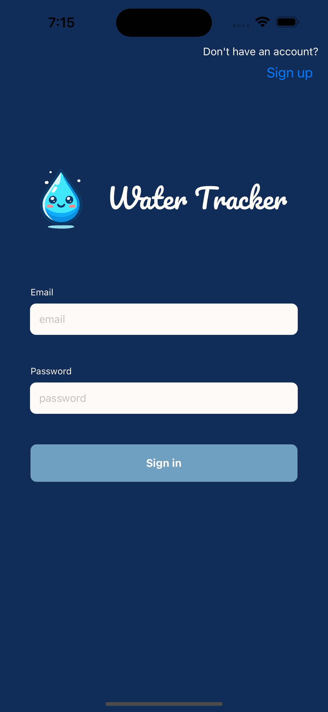
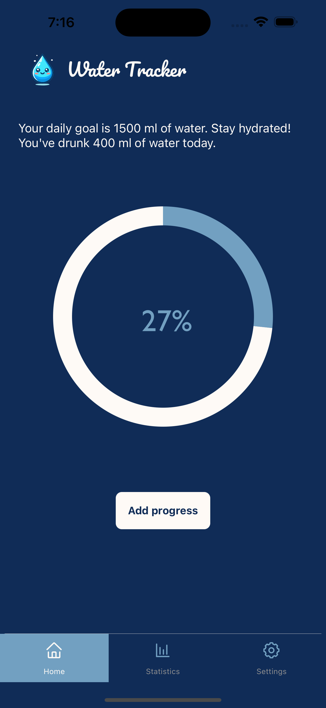
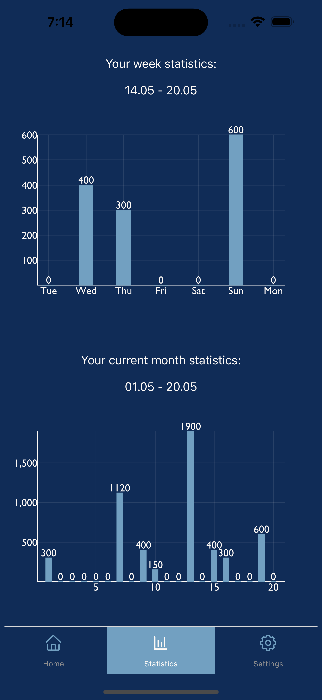

<br />
<p align="center">
  <a href="https://github.com/henettaja/water-tracker/">
    
  </a>

  <h3 align="center">Water tracker</h3>

  <p align="center">
    A React Native app to track daily water intake.
  </p>
</p>

## About The Project

An app to track daily water intake made using [Expo](https://expo.io/), [React Native](https://reactnative.dev/) and [Firebase Realtime Database](https://firebase.google.com/docs/database).

  

## Getting Started

To get a local copy up and running follow these simple steps.

### Prerequisites

You need these on your computer before you start

- npm

Install npm by following these instructions: [Get npm](https://www.npmjs.com/get-npm)

- Expo CLI

```sh
npm install --global expo-cli
```

### Installation

1. Clone the repo
   ```sh
   git clone https://github.com/LilBr21/water-tracker.git
   ```
2. Install NPM packages
   ```sh
   npm install
   ```
3. Start Expo
   ```sh
   expo start
   ```
